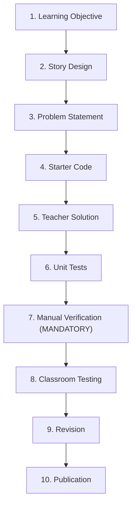
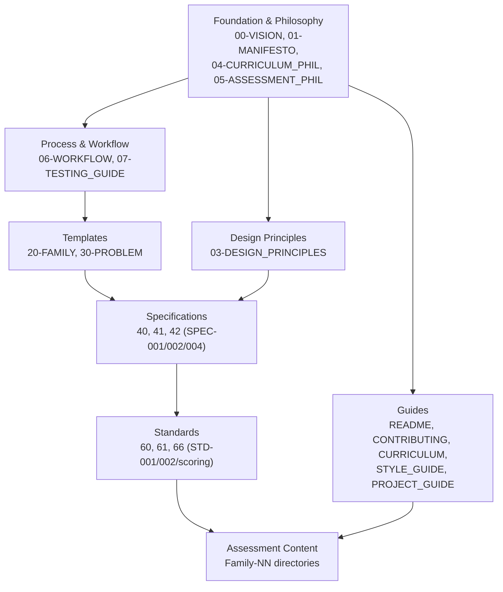

# PyPractical — Project Context (Second Brain)

> This file is a **living context document** for AI assistants and contributors working
> on the PyPractical project. Its purpose is to let any new session read this file first
> and immediately gain full, working knowledge of the project: its mission, structure,
> conventions, standards, and current state. Treat it as the "second brain" of the project.
>
> When you begin a new session, read this file in full before touching any other file. It
> is comprehensive by design and intentionally redundant with the source documents so that
> you rarely need to open them. When the project evolves — new families are added, specs
> change, or conventions shift — update this file so it stays accurate.

---

## 1. What Is PyPractical? (Quick Summary)

PyPractical is an **open educational resource** providing classroom-tested,
automatically-gradable **Python programming assessments** for introductory Python and
Object-Oriented Programming (OOP) courses. The target audience is primarily **Grade 9
students** and their teachers.

Key facts:

- **Mission:** "To make high-quality programming assessment accessible to every teacher,
  regardless of experience, budget, or class size."
- **Core idea:** Programming is learned by programming. Assessments should illuminate
  learning, not obscure it.
- **Target Python version:** 3.10+
- **Audience:** Grade 9 students (intro level)
- **Grading model:** Automatic via Python `unittest` — score = percentage of passing tests
  (all tests carry equal weight).
- **License:** Dual — CC BY-SA 4.0 (documents) + MIT (code).
- **Current state:** **Round 1 (Foundation) is COMPLETE.** The repo now contains two
  canonical, spec-compliant, runnable reference problems plus a class-based spec
  addendum (SPEC-005). Round 2 (OOP families) is COMPLETE — 40 problems, 473 tests green. See Section 23 for
  progress, and `plans/round-1-foundation-plan.md` for the plan.

---

## 2. Repository File Map

A structured listing of every file in the repo with its purpose, grouped logically.
All links are relative from `inceptions/` (hence the `../` prefix).

### Philosophy & Vision

- [`00-PROJECT_VISION.md`](../00-PROJECT_VISION.md) — Founding story and long-term vision
- [`01-MANIFESTO.md`](../01-MANIFESTO.md) — 7-line declaration of core beliefs (the north star)
- [`03-DESIGN_PRINCIPLES.md`](../03-DESIGN_PRINCIPLES.md) — 10 governing design principles
  for every assessment
- [`04-CURRICULUM_PHILOSOPHY.md`](../04-CURRICULUM_PHILOSOPHY.md) — Pedagogical reasoning
  behind curriculum structure
- [`05-ASSESSMENT_PHILOSOPHY.md`](../05-ASSESSMENT_PHILOSOPHY.md) — Theory and ethics of
  assessment

### Process & Workflow

- [`06-WORKFLOW.md`](../06-WORKFLOW.md) — 10-step development lifecycle for assessments
- [`07-TESTING_GUIDE.md`](../07-TESTING_GUIDE.md) — How to test/verify the assessment itself
- [`08-CHANGELOG.md`](../08-CHANGELOG.md) — Versioning philosophy and change recording

### Templates

- [`20-FAMILY_TEMPLATE.md`](../20-FAMILY_TEMPLATE.md) — Required README template for each
  assessment family
- [`30-PROBLEM_TEMPLATE.md`](../30-PROBLEM_TEMPLATE.md) — Master template for each
  individual problem (8 sections + checklist)

### Specifications (SPEC system)

- [`40-problem-markdown-spec.md`](../40-problem-markdown-spec.md) — SPEC-001: required
  Markdown structure of student problem statements
- [`41-python-template-spec.md`](../41-python-template-spec.md) — SPEC-002: required
  structure of student starter code
- [`42-unittest-spec.md`](../42-unittest-spec.md) — SPEC-004: required structure of unittest
  files (**NOTE:** SPEC-003 is skipped/missing)
- [`43-oop-class-spec.md`](../43-oop-class-spec.md) — SPEC-005: class-based (OOP) problem
  spec, extending SPEC-001/SPEC-002 to classes (added in Round 1)

### Standards (STD system)

- [`60-python-style-std.md`](../60-python-style-std.md) — STD-001: Python coding style
- [`61-markdown-style-std.md`](../61-markdown-style-std.md) — STD-002: Markdown style
- [`66-assessment-scoring-std.md`](../66-assessment-scoring-std.md) — The 6 canonical scoring
  rules (no formal STD ID header)

### Guides & Onboarding

- [`README.md`](../README.md) — Main project overview (the front door)
- [`CONTRIBUTING.md`](../CONTRIBUTING.md) — How to contribute and cultural expectations
- [`CURRICULUM.md`](../CURRICULUM.md) — Full 6-stage curriculum journey
- [`STYLE_GUIDE.md`](../STYLE_GUIDE.md) — Consolidated practical style guidance
- [`PROJECT_GUIDE.md`](../PROJECT_GUIDE.md) — AI engineer operational guide
  (system-prompt-style)
- [`topics.md`](../topics.md) — Source curriculum topics (OOP & Data Handling,
  "SG" references)

### Values & Culture

- [`mission_statement.md`](../mission_statement.md) — Single-sentence mission
- [`teachers_promise.md`](../teachers_promise.md) — Commitment to students' time
- [`educators_pledge.md`](../educators_pledge.md) — Appeal to share improvements back
- [`LICENSE.md`](../LICENSE.md) — Dual licensing (CC BY-SA 4.0 + MIT)
- [`licenseOur_promise.md`](../licenseOur_promise.md) — 6 cultural promises accompanying the
  license

### Assessment Content & Plans (Round 1+)

- [`Family-01-Minimum-Cost/01-Parking-Garage/`](../Family-01-Minimum-Cost/01-Parking-Garage/problem.md)
  — canonical **function-based** reference problem (6 deliverables, 12 tests)
- [`Family-03-Classes-and-Objects/01-TV-Recorder/`](../Family-03-Classes-and-Objects/01-TV-Recorder/problem.md)
  — canonical **class-based (OOP)** reference problem (6 deliverables, 14 tests)
- [`plans/round-1-foundation-plan.md`](../plans/round-1-foundation-plan.md) — Round 1 plan
  and outcome (task scorecard + results)
- `examples/` — legacy pre-spec snippets (parking-garage, internet-cafe, tv-recording);
  kept as-is, superseded by the canonical `Family-NN/` versions

---

## 3. The 6 Standard Deliverables (Every Assessment)

Every problem must include these 6 deliverables:

1. 📄 **Markdown problem statement** (`problem.md`)
2. 🐍 **Python starter template** (`starter.py`)
3. ✅ **Python unittest suite** (`tests.py`)
4. 👨‍🏫 **Teacher reference solution** (`solution.py`)
5. 📝 **Teacher notes** (`teacher_notes.md`)
6. 📋 **Metadata** (`metadata.yml`) — learning objectives + difficulty

---

## 4. Repository Structure Convention

The planned concrete file layout (from [`PROJECT_GUIDE.md`](../PROJECT_GUIDE.md)):

```text
PyPractical/
├── 00-PROJECT_VISION.md  ...  (philosophy, specs, standards — root level)
├── README.md
├── CONTRIBUTING.md
├── ...
├── Family-01-Minimum-Cost/
│   ├── README.md                          (follows 20-FAMILY_TEMPLATE.md)
│   ├── 01-Parking-Garage/
│   │   ├── problem.md
│   │   ├── starter.py
│   │   ├── solution.py
│   │   ├── tests.py
│   │   ├── metadata.yml
│   │   └── teacher_notes.md
│   ├── 02-Internet-Cafe/
│   ├── 03-Theme-Park/
│   └── 04-Printing-Center/
├── Family-02-Intro-OOP/
├── Family-03-Collections/
├── Family-04-Inheritance/
└── Family-05-Searching/
```

Each problem directory contains: `problem.md`, `starter.py`, `solution.py`, `tests.py`,
`metadata.yml`, `teacher_notes.md`, organized under `Family-NN-Name/NN-Problem-Name/`.

---

## 5. The 10 Design Principles

From [`03-DESIGN_PRINCIPLES.md`](../03-DESIGN_PRINCIPLES.md):

1. **One New Idea** — one primary concept per assessment.
2. **Authentic Stories** — resemble real beginner-writable software.
3. **Natural Algorithms** — loops/conditionals arise from the story, not to test the
   construct.
4. **Early Success** — student understands the goal within the first minute.
5. **Readability Matters** — clean code, meaningful names.
6. **Objective Grading** — automatically gradable via `unittest`.
7. **Classroom Reality** — designed for real time limits; teacher workload is a design
   constraint.
8. **Equivalent Assessments** — multiple sections get isomorphic (equivalent, not identical)
   problems.
9. **Open Education** — adapt, improve, redistribute.
10. **Continuous Improvement** — every assessment should evolve with classroom feedback.

---

## 6. The Development Workflow (10 Steps)

The 10-step lifecycle from [`06-WORKFLOW.md`](../06-WORKFLOW.md):



Key rules:

- **Step 7 (Manual Verification) is mandatory** — never rely solely on AI arithmetic or
  mental math.
- Every expected value must be independently verified (manual calc / independent solution /
  peer review).
- The quality checklist must pass before publishing.
- "Whenever there is a conflict between speed and quality, we choose quality."

---

## 7. Problem Statement Structure (SPEC-001)

The required section order for every student-facing `problem.md` (from
[`40-problem-markdown-spec.md`](../40-problem-markdown-spec.md)):

```text
# Title
## Story
## Task
## Function Specification
### Parameters
### Returns
## Constraints
## Example
## Explanation
## Hint
```

> **Note:** `STYLE_GUIDE.md` and `PROJECT_GUIDE.md` list a slightly different order
> (Story → Task → Parameters → Returns → Example → Explanation → Hint →
> Constraints, with Constraints last). SPEC-001 places Constraints **before** Example.
> When in doubt, follow SPEC-001 as the formal specification. This is a known
> inconsistency to reconcile (see Section 19).

**Language:** Write for Grade 9 students — everyday vocabulary, active voice, short
sentences. **Tone:** encouraging. **Line length:** ≤ 100 chars.

---

## 8. Starter Code Structure (SPEC-002)

Required file structure for `starter.py` (from
[`41-python-template-spec.md`](../41-python-template-spec.md)):

```text
Module Docstring → Function Definition → Function Docstring → TODO Section
→ Placeholder Return → (Optional) Main Guard
```

Key rules:

- Exactly **ONE** public function, descriptive `snake_case` name.
- **NO type hints** (Grade 9 focus on concepts first).
- **NO `pass` as placeholder** — use `return 0`, `return []`, `return ""` by return type
  (`pass` causes confusing test failures).
- **NO algorithm hints in the code** — hints belong in the problem statement.
- Use function parameters, **NOT** `input()`/`print()` (auto-grading relies on function
  calls).
- **NO global variables**, **NO exception handling** (unless that is the lesson),
  **NO unnecessary imports**.
- Python 3.10+ compatible.
- Descriptive names: `parking_hours`, `total_revenue` (avoid `a`, `x`, `temp`, `list1`).
- **Docstrings: Google style** (Args/Returns) across the whole bank (set in Round 1).
- **Class-based (OOP) assessments:** follow **SPEC-005** (`43-oop-class-spec.md`), which
  adapts these rules to classes and methods (e.g., `__init__`/void methods use a bare
  `return` placeholder).

---

## 9. Unit Test Structure (SPEC-004)

Required file structure for `tests.py` (from
[`42-unittest-spec.md`](../42-unittest-spec.md)):

```text
Imports → Student Solution Import → Test Class → Test Methods → Main Guard
```

Key rules:

- Evaluate **observable behavior, not implementation** — correct solutions pass regardless
  of loops/helpers/variable names.
- Every test method starts with `test_` and describes the behavior.
- One behavior per test (avoid `test_everything()`).
- Test categories: **Basic, Boundary, Typical, Mixed, Hidden**.
- **Hidden tests verify documented behavior ONLY** — never introduce new requirements. If a
  hidden test needs undocumented behavior, revise the assessment, not the student.
- **Equal weight:** every test contributes equally.
- Tests must be independent (no shared mutable state).
- **NO random inputs** — tests must be deterministic.
- Every expected value independently verified.
- **Main guard:** by convention included but **commented out** (some learning-management
  systems run the suite their own way). The canonical way to run a suite is
  `python3 -m unittest tests`, from inside the problem folder.

Example structure:

```python
import unittest
from solution import calculate_daily_revenue


class TestParkingGarage(unittest.TestCase):

    def test_single_customer(self):
        result = calculate_daily_revenue([3], 5, 10)
        self.assertEqual(result, 25)


# Run locally with:  python3 -m unittest tests
# if __name__ == "__main__":
#     unittest.main()
```

---

## 10. The Scoring Model (Canonical — 6 Rules)

From [`66-assessment-scoring-std.md`](../66-assessment-scoring-std.md) — the single
authoritative definition:

1. Every unit test has equal weight.
2. Every test measures one observable behavior.
3. A student's score is the percentage of passing tests.
4. Tests are independent whenever practical.
5. Hidden tests assess documented behavior only.
6. The number of tests should balance coverage with meaningful feedback.

**Formula:** `score = (passing tests ÷ total tests) × 100%`

---

## 11. Python Style Quick Reference (STD-001)

A concise reference of key conventions (from
[`60-python-style-std.md`](../60-python-style-std.md)):

- PEP 8 when appropriate, but **educational clarity always wins**.
- Indentation: **4 spaces**, never tabs.
- Line length: ≤ 100 chars.
- Variable names: descriptive (`parking_hours`, `total_revenue`).
- Function names: verbs (`calculate_total()`, `find_student()`).
- Class names: PascalCase (`Recorder`, `LibraryBook`).
- Constants: UPPER_CASE (`MAX_CAPACITY = 50`).
- Comments: explain **why**, not **what**.
- Docstrings: every public function — purpose, parameters, return.
- Conditionals: explicit comparisons; avoid compact ternary unless conditional expressions
  are the lesson.
- Loops: readable (`for customer in customers:`).
- Collections progression: Variables → Lists → Dictionaries → Objects.
- Functions: one logical task, ~30 lines or fewer.
- **Avoid** (unless explicit objectives): decorators, generators, lambda, list
  comprehensions, recursion, context managers.
- **The Readability Rule:** "If a beginner would ask 'What does this line do?' — rewrite
  it."

---

## 12. Markdown Style Quick Reference (STD-002)

From [`61-markdown-style-std.md`](../61-markdown-style-std.md):

- ATX headings (`#`); never skip levels; exactly one level-one heading per document.
- Blank lines around headings, code blocks, lists.
- Code blocks: always fenced with a language tag (` ```python `).
- Inline code: backticks for filenames, commands, function/variable/class names.
- Tables: only when they improve clarity.
- Line length: ≤ 100 chars.
- Cross references: use filenames (e.g., "See 06-WORKFLOW.md."), never "the previous
  document".
- File naming: lowercase, hyphens, descriptive, no spaces.
- Notes format: `> **Note:** ...`

---

## 13. Document ID System

| Document ID | File                                  | Purpose                |
|-------------|---------------------------------------|------------------------|
| SPEC-001    | 40-problem-markdown-spec.md           | Problem Markdown structure |
| SPEC-002    | 41-python-template-spec.md            | Starter code structure |
| SPEC-003    | 44-metadata-spec.md                   | Metadata (`metadata.yml`) schema |
| SPEC-004    | 42-unittest-spec.md                   | Unit test structure    |
| SPEC-005    | 43-oop-class-spec.md                  | Class-based (OOP) spec |
| STD-001     | 60-python-style-std.md                | Python style           |
| STD-002     | 61-markdown-style-std.md              | Markdown style         |
| (none)      | 66-assessment-scoring-std.md          | Scoring rules          |

> **Note:** SPEC-003 was previously a gap; it is now defined by [`44-metadata-spec.md`](../44-metadata-spec.md).

---

## 14. Curriculum Overview (6 Stages)

From [`CURRICULUM.md`](../CURRICULUM.md):

| Stage | Focus                       | Key Concepts                                                        | Example Families                                                        |
|-------|-----------------------------|---------------------------------------------------------------------|-------------------------------------------------------------------------|
| 1     | Thinking Like a Programmer  | Variables, I/O, Arithmetic, Conditionals, Loops, Functions          | Minimum Cost, Counting/Totals, Decision Making, Basic Simulations       |
| 2     | Thinking About Objects      | Classes, Objects, Attributes, Methods                               | TV Recorder, Library, Hotel Reservation, Student Records                |
| 3     | Objects Working Together    | Lists of Objects, Searching, Collaboration                          | Library Management, Restaurant Orders, School Clinic                    |
| 4     | Building Better Software    | Inheritance, Polymorphism, Composition                              | (planned)                                                               |
| 5     | Data and Algorithms         | Searching, Sorting, Dictionaries, Files                             | (planned)                                                               |
| 6     | Projects                    | Culminating projects combining everything                           | (planned)                                                               |

---

## 15. Source Curriculum Topics (from topics.md)

This maps the actual school syllabus. "SG" = Study/Strand Guide reference number (the source
curriculum). See [`topics.md`](../topics.md).

- **SG 2:** Computational Thinking Skills (review)
- **SG 3:** Introduction to OOP (Procedural vs OOP)
- **SG 4-5:** Classes and Objects (attributes, methods, class diagrams)
- **SG 6-7:** Relationships (association, multiplicity, aggregation, composition,
  inheritance, dependency)
- **SG 8:** Encapsulation
- **SG 9:** Inheritance
- **SG 10:** Method Overriding
- **SG 11:** Polymorphism
- **SG 12:** Abstraction
- **SG 18:** Data Handling (text files, cleaning, transformation)
- **SG 19:** Basic Data Analysis (descriptive statistics)
- **SG 20:** Data Sources — **JSON recommended** (also CSV, TXT, XML); data manipulation
- **SG 27:** SOLID Principles — **emphasis on Single Responsibility (S) only**

---

## 16. Family Template Structure (20-FAMILY_TEMPLATE.md)

A **family** = multiple equivalent practicals teaching the same objective via different
stories. From [`20-FAMILY_TEMPLATE.md`](../20-FAMILY_TEMPLATE.md). Required README sections:

- Family Title, Overview, Primary Learning Objective
- Concepts Reinforced (must support, not compete with, the objective)
- Prerequisites, Estimated Classroom Time (~20-30 min total)
- Difficulty (Beginner | Beginner+ | Intermediate | Advanced)
- Assessment Type (Diagnostic | Guided Practical | Fill-in Practical | Independent
  Practical | Project)
- Assessment Variants table (Problem | Story | Status)
- Learning Progression (Previous / Current / Next family)
- Common Student Mistakes
- Teaching Notes
- Automatic Assessment description
- Future Extensions
- Revision History

---

## 17. Problem Template Structure (30-PROBLEM_TEMPLATE.md)

8 sections per problem, from [`30-PROBLEM_TEMPLATE.md`](../30-PROBLEM_TEMPLATE.md):

1. **Problem Information** (Title, Family, Objective, Difficulty, Time)
2. **Student Problem Statement** (Story, Task, Parameters, Returns, Constraints, Example,
   Explanation, Hints)
3. **Starter Code**
4. **Teacher Solution**
5. **Unit Tests**
6. **Teacher Notes** (Objectives, Reinforced, Common Mistakes, Strategy)
7. **Assessment Metadata** (table)
8. **Revision History**

---

## 18. Core Project Values & Culture

The recurring "Our Promise" (appears in README, curriculum & assessment philosophy, and the
license):

> "Every assessment in PyPractical should be good enough that its authors would be happy to
> use it in their own classroom tomorrow."

The 6 cultural promises (from [`licenseOur_promise.md`](../licenseOur_promise.md)):

1. Students before technology.
2. Teachers before convenience.
3. Clarity over cleverness.
4. Admit mistakes openly.
5. Improve when classrooms teach better ways.
6. Every contribution guided by "Would we use this in our classroom tomorrow?"

**Key beliefs:** learning by doing; regular success builds confidence; assessment illuminates
(not obscures); build for classrooms, not competitions; respect for student **AND** teacher
time.

---

## 19. Known Inconsistencies & Notes for Contributors

Documented known issues — be aware of these when working in the repo:

1. **Section ordering discrepancy:** `STYLE_GUIDE.md` and `PROJECT_GUIDE.md` list Constraints
   last; SPEC-001 places Constraints before Example. **Follow SPEC-001** as the formal spec.
2. **SPEC-003 missing:** The SPEC sequence skips from SPEC-002 to SPEC-004.
3. **66-assessment-scoring-std.md has no STD ID header** — it's plain text, unlike the other
   STD documents.
4. **File-name references inconsistent:** `CONTRIBUTING.md` references
   `DESIGN_PRINCIPLES.md` but the actual file is `03-DESIGN_PRINCIPLES.md` (numbered prefix).
   The same discrepancy exists for other cross-references.
5. **Repository structure varies between docs:** `README.md` shows a simplified structure;
   `PROJECT_GUIDE.md` shows the detailed per-problem file layout. **Use PROJECT_GUIDE.md's
   structure as authoritative.**
6. **Assessment content (Round 1 foundation):** two canonical reference problems now exist
   — `Family-01-Minimum-Cost/01-Parking-Garage/` (function) and
   `Family-03-Classes-and-Objects/01-TV-Recorder/` (OOP) — plus SPEC-005. Full isomorphic variants
   per topic are built in Round 2. The legacy `examples/` snippets pre-date the specs and
   are NOT compliant (they use `pass` and lack the test import/guard) — treat the
   `Family-NN/` versions as canonical.

---

## 20. Quick Reference: Common Tasks for AI Sessions

Practical guidance for common operations.

### Creating a new assessment

1. Determine the **ONE** primary learning objective.
2. Design an authentic story (could real software do this?).
3. Write `problem.md` following **SPEC-001** (section order).
4. Write `starter.py` following **SPEC-002** (no type hints, no `pass`, placeholder return).
5. Write `solution.py` (readable, beginner-friendly, **STD-001**).
6. Write `tests.py` following **SPEC-004** (behavior not implementation, equal weight).
7. **Mandatory:** manually verify EVERY expected value — never trust AI arithmetic alone.
8. Write `teacher_notes.md` and `metadata.yml`.
9. Create/update the family `README.md` using
   [`20-FAMILY_TEMPLATE.md`](../20-FAMILY_TEMPLATE.md).

### Verifying expected outputs

- Solve by hand.
- Cross-check with an independent solution.
- Peer review.
- "One incorrect expected value is enough to reduce confidence in an otherwise excellent
  assessment."

### Style checks before submitting

- [ ] Problem follows SPEC-001 section order
- [ ] Starter code follows SPEC-002 (no type hints, no `pass`, placeholder return)
- [ ] Tests follow SPEC-004 (behavior-based, equal weight, deterministic)
- [ ] Python code follows STD-001 (descriptive names, readable, ≤100 char lines)
- [ ] Markdown follows STD-002 (ATX headings, fenced code, ≤100 char lines)
- [ ] Scoring follows 66-assessment-scoring-std.md (6 rules)
- [ ] All expected values independently verified

### Important "Never Do" List

- Never rely solely on AI for expected values without manual verification.
- Never write tests that check implementation details (how), only behavior (what).
- Never include hidden tests that require undocumented behavior.
- Never use `pass` as a placeholder return.
- Never use `input()`/`print()` in starter code (auto-grading needs function returns).
- Never use type hints in starter code.
- Never add unnecessary complexity to increase difficulty.
- Never use random inputs in published tests.
- Never include teacher/hidden solutions in starter code.

---

## 21. Glossary

- **Family** — A group of equivalent (isomorphic) practicals teaching the same primary
  objective via different stories.
- **Isomorphic** — Same concepts, similar effort, comparable difficulty, but different
  stories/examples (for fairness across sections).
- **Learning Objective** — The ONE primary concept an assessment teaches (everything else
  reinforces prior learning).
- **Starter Code** — The template students begin with (function signature, docstrings,
  TODOs, placeholder return).
- **Hidden Tests** — Tests not shown to students that verify the general problem (not just
  memorized examples); must only test documented behavior.
- **Equal Weight** — Every test contributes equally to the score.
- **SG** — Study/Strand Guide reference number (the source curriculum).
- **Primary Learning Objective** — The single new concept introduced; all other concepts must
  be prior knowledge being reinforced.
- **SPEC-001 through SPEC-004** — Formal specifications for document/code structure.
- **STD-001, STD-002** — Formal style standards.

---

## 22. Document Relationships

How the documents relate to one another:



---

## 23. Round-by-Round Progress

| Round | Scope | Status |
|---|---|---|
| Round 1 — Foundation | SPEC-005 addendum + 2 canonical references (function + OOP); Google docstrings standardized | ✅ Complete (2026-08-02); 26/26 tests pass |
| Round 2 — OOP families | Scale OOP families in dependency order (SG 3 → 4 → 5 → 8 → 9 → 10 → 11 → 12 → 6 → 7 → 27); ~3-4 isomorphic problems each | ✅ Complete (2026-08-03); 40 problems, 473 tests, all green; see `plans/round-2-oop-families-plan.md` |
| Round 3 — Data handling | SG 18 (files) → 19 (analysis) → 20 (JSON); needs a file-I/O fixture pattern | ⏳ Not started |

> **Round 2 outcome:** 40 problems (1 function reference + 39 OOP), 240 files, 473 tests — all pass via `python3 -m unittest tests` in every folder. Families were renumbered to match teaching order: Family-02-Intro-OOP now covers SG 3, and the TV Recorder moved to Family-03-Classes-and-Objects. The `tests.py` main guards are commented out for LMS compatibility (verify with `python3 -m unittest tests`).

> **Note:** This file should be updated as the project evolves. It is a **living document**.
> When new families are added, specs change, or conventions evolve, update this context file
> so every future session starts with accurate, current knowledge.
